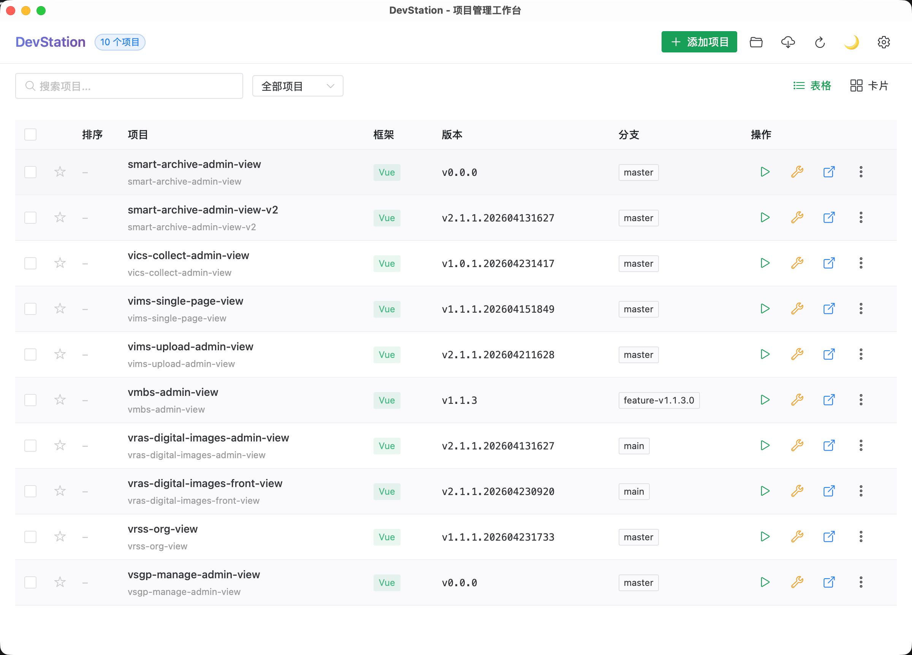

# DevStation

一款 macOS 桌面前端项目管理工具，基于 Tauri 2 + Vue 3 + TypeScript + Naive UI 构建。在一个界面内管理所有前端项目的开发、构建、Git 操作。



## 功能特性

### 项目管理
- **添加项目** — 单个或批量选择项目文件夹导入，自动识别 `package.json`
- **扫描工作区** — 选择工作区文件夹，自动扫描所有子项目
- **框架识别** — 自动检测 Vue、React、Angular、Svelte、Nuxt、Next.js
- **版本读取** — 自动展示项目版本号
- **Git 信息** — 自动获取分支名和远程仓库地址
- **收藏项目** — 星标收藏，快速筛选
- **自定义排序** — 双击排序号输入数字自定义排列顺序
- **搜索过滤** — 按项目名、目录名、路径、框架搜索
- **批量删除** — 勾选多个项目从列表移除

### 开发运行
- **一键启动 Dev** — 点击运行按钮在新终端窗口中启动开发服务器
- **一键打包 Build** — 在新终端窗口中执行打包命令
- **运行/停止切换** — 运行中按钮变为停止，一键停止对应端口进程
- **自定义命令** — 每个项目可单独配置 dev 和 build 命令，覆盖全局默认值
- **运行任意脚本** — 下拉菜单中可直接运行 package.json 中的任意脚本

### 工具集成
- **打开 IDE** — 一键用 Trae / VS Code 打开项目
- **打开终端** — 在 Terminal.app 中 cd 到项目目录
- **打开 Finder** — 在 Finder 中显示项目
- **Git Pull** — 单项目或批量 Git Pull
- **过期依赖检查** — 检查项目中的过期依赖包

### 视图切换
- **表格视图** — 信息密度高，适合项目管理
- **卡片视图** — 直观展示，适合快速浏览

## 安装

### 下载安装
从 Release 页面下载 `.dmg` 安装包，拖入 Applications 即可。

安装后如提示"已损坏"，执行：
```bash
sudo xattr -rd com.apple.quarantine /Applications/DevStation.app
```

### 从源码构建

**环境要求：**
- Node.js >= 18
- pnpm
- Rust (via rustup)
- Xcode Command Line Tools

```bash
# 克隆项目
git clone https://github.com/your-repo/devstation.git
cd devstation

# 安装依赖
pnpm install

# 开发模式
pnpm tauri dev

# 打包构建
pnpm tauri build
```

构建产物在 `src-tauri/target/release/bundle/` 下：
- `dmg/` — .dmg 安装包
- `macos/` — .app 应用

可选参数：
```bash
pnpm tauri build --bundles app   # 只生成 .app
pnpm tauri build --no-sign       # 跳过签名
```

## 使用说明

### 首次使用
1. 打开 DevStation
2. 点击右上角「添加项目」选择一个或多个项目目录
3. 或点击文件夹图标扫描整个工作区

### 日常操作
| 操作 | 说明 |
|------|------|
| 运行 Dev | 点击绿色播放按钮，在新终端启动开发服务器 |
| 停止 Dev | 运行中按钮变红，点击停止端口进程 |
| 打包 Build | 点击黄色打包按钮 |
| 打开 IDE | 点击蓝色打开按钮 |
| 配置命令 | `...` 菜单 → 配置命令，可单独设置 dev/build 命令 |
| 修改排序 | 双击排序列的数字，输入新值后回车 |
| 修改名称 | 双击项目名称，输入后回车 |
| 收藏/取消 | 点击星标图标 |
| 搜索 | 搜索框输入关键词 |
| 筛选收藏 | 下拉选择"已收藏" |
| 检查依赖 | `...` 菜单 → 检查过期依赖 |

### 全局设置
点击右上角齿轮图标进入设置：
- 工作区文件夹管理
- IDE 名称（默认 Trae）
- 包管理器（默认 pnpm）
- Dev 脚本名（默认 dev）
- Build 脚本名（默认 build）

## 技术栈

- **前端**：Vue 3 + TypeScript + Naive UI + Pinia
- **后端**：Rust + Tauri 2
- **数据存储**：本地 JSON 文件 (`~/.devstation/config.json`)

## License

MIT
